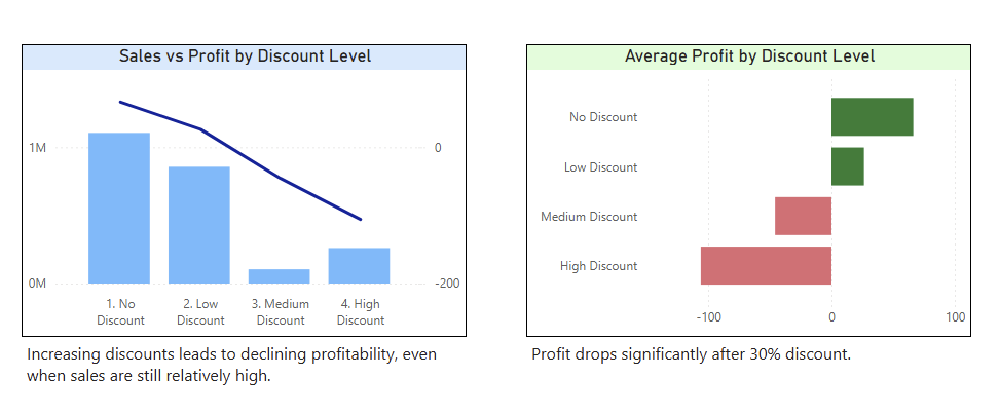

# Retail Sales Analysis

📊 Project Overview

This project analyzes retail sales data to identify key drivers of profitability and understand how discount strategies impact business performance.

🛠 Tools Used
	•	SQL
	•	Power BI
	•	Google Sheets

📈 Key Metrics
	•	Total Sales: 2.33M
	•	Total Profit: 292K
	•	Profit Margin: 12.56%

🔍 Key Insights
	•	Furniture category has significantly lower profitability compared to others
	•	Tables is the most loss-making sub-category
	•	Higher discounts are strongly associated with lower profitability
	•	Negative profit starts appearing beyond ~25–30% discount levels

📉 Business Recommendation

Reducing excessive discounting, especially above 30%, can improve overall profitability and reduce losses in key sub-categories like Tables.

📂 Project Assets
	•	Power BI Dashboard (PDF)
	•	Dataset: Sample Superstore

🚀 What I Learned
	•	How to move from raw data to actionable insights
	•	Identifying root causes behind business problems
	•	Building clear and impactful data visualizations

## 📊 Customer Segmentation Dashboard

## 📉 Discount Impact Analysis

As an extension of the original retail sales project, I analyzed how discount levels affect profitability.

Key Findings
	•	Profitability decreases as discount levels increase
	•	Discounts above ~30% are associated with negative profit
	•	High discounts may still generate sales, but they significantly reduce overall profitability

### Key Takeaway
Higher sales do not always mean better business performance. In this case, aggressive discounting increased sales activity but reduced profitability.

## 📊 Discount Impact Dashboard

## 📊 Category & Product Profitability Analysis

To further investigate profitability, I analyzed performance at the category and sub-category level.

## Key Findings
	•	Furniture generates high sales but relatively low profit
	•	Tables and Bookcases are the main loss-driving sub-categories
	•	A small number of sub-categories are responsible for most of the losses
	•	High sales do not always guarantee profitability

## Visual Analysis

Sub-Category Profitability
Revenue vs Profit by Sub-Category

## Key Insight

A small number of sub-categories, particularly Tables, drive a disproportionate share of total losses.

## 📊 Sub-Category Profitability Analysis Dashboard

